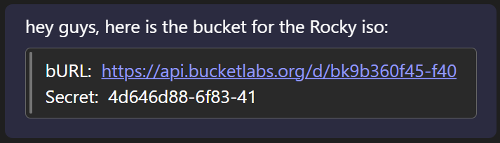
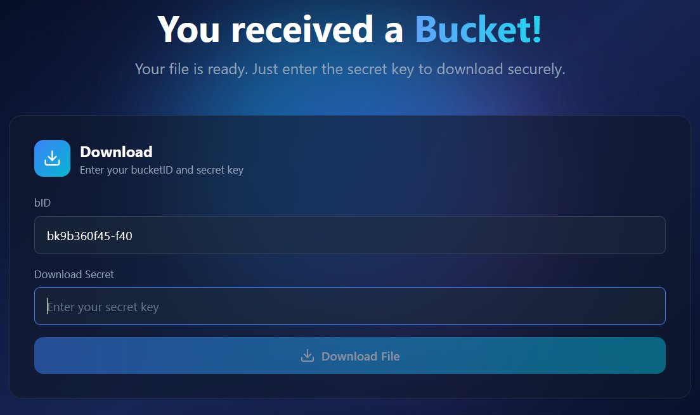
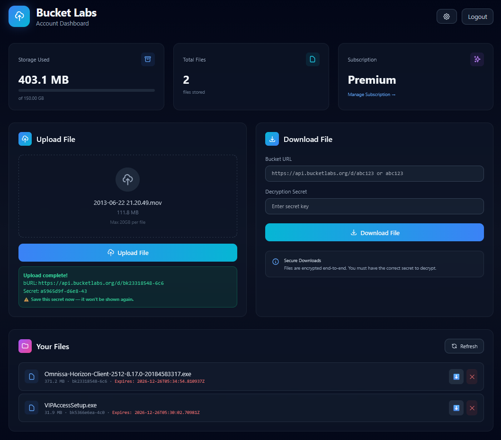

# 🪣 Bucket: *Share Files Like You Ship Code*
**Security isn’t a feature. It’s the architecture.**
### Documentation 👉 [docs.bucketlabs.org](http://docs.bucketlabs.org) 
## Installation
Installs in seconds:
```sh
# WSL/MacOS/Linux
curl -sSL bucketlabs.org/install.sh | bash
```

```powershell
# Windows (powershell)
irm bucketlabs.org/install.ps1 | iex 
```

## What is bucket?
You’ve got a 16GB Rocky 9.7 ISO that needs to get into someone else’s hands.
```
WeTransfer?   🙄   Too many steps...

Teams?        🤦   Too large...

OneDrive?     🤬   #%!
```

### Just run one command
```sh
$ bucket push ./isos/Rocky-9.7-Custom-KS-x86_64-minimal.iso
```
And bucket gives you exactly what you need: 
```yml
           ✓ Upload complete!
    bID:  bk9b360f45-f40
   bURL:  https://api.bucketlabs.org/d/bk9b360f45-f40
 Secret:  4d646d88-6f83-41
Expires:  2026-06-25T00:00:00Z
```
A link.
A secret.
An expiration.

No lingering attachments.

<p align="right">
  
</p>

### Your technical colleagues know what to do
```sh
$ bucket pull bk9b360f45-f40
Enter secret: 
Downloaded: Rocky-9.7-Custom-KS-x86_64-minimal.iso
```
Straight to disk. 
No mouse required. 

### Non-technical colleagues? 
<p align="center">
  
</p>

They click the bURL, enter the secret, and download.
That’s it. No instructions. No emails. No frustration.

### Not a terminal person? We have a dashboard for you.
<p align="right">
  
</p>

## bucket philosophy
- Security is the architecture
- The terminal is the primary interface
- The larger the file, the stronger the use-case
- Links are ephemeral
- Secrets stay secret
- Upload it. Share it. Move on.

<p align="center">
  © 2025 Bucket Labs · Built with ❤️ for developers.
</p>

